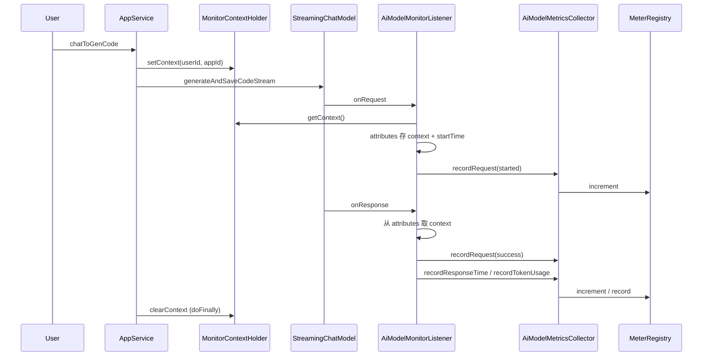

```mermaid
flowchart LR
    A[AppServiceImpl.chatToGenCode] -->|setContext| B[MonitorContextHolder]
    B --> C[StreamingChatModel / ReasoningStreamingChatModel]
    C -->|listeners| D[AiModelMonitorListener]
    D --> E[AiModelMetricsCollector]
    E --> F[MeterRegistry / Micrometer]
    F --> G["/api/actuator/prometheus"]
    G --> H[Prometheus]
    H --> I[Grafana Dashboard]
```

# AI 模型监控模块说明

本文档梳理项目中 AI 模型监控的完整实现流程，涵盖 LangChain4j 监听器、Micrometer、Spring Boot Actuator、Prometheus 与 Grafana 之间的关系。

---

## 一、整体架构

```
业务入口设置上下文
    ↓
LangChain4j 监听器采集
    ↓
Micrometer 登记指标（内存）
    ↓
Actuator 暴露 HTTP 端点
    ↓
Prometheus 定时拉取（scrape）
    ↓
Grafana 可视化
```



---

## 二、核心组件与职责

| 组件 | 所属 | 职责 |
|------|------|------|
| **LangChain4j `ChatModelListener`** | LangChain4j | 提供钩子：`onRequest` / `onResponse` / `onError`，**不提供现成的 Prometheus 指标** |
| **AiModelMonitorListener** | 本项目 | 在钩子中采集请求、耗时、Token、错误 |
| **AiModelMetricsCollector** | 本项目 | 用 Micrometer 的 Counter / Timer 登记自定义指标 |
| **Micrometer** | 独立库（Spring 生态） | 应用内指标门面，在内存中维护指标值 |
| **micrometer-registry-prometheus** | Micrometer 插件 | 将 Micrometer 指标 **在 scrape 时** 翻译成 Prometheus 文本格式 |
| **Spring Boot Actuator** | Spring Boot | 在同一 Web 应用上暴露 `/actuator/*` 运维端点（非独立进程） |
| **Prometheus** | CNCF 独立系统 | 定时 HTTP 拉取指标，解析后存入时序数据库 |
| **Grafana** | 独立可视化产品 | 从 Prometheus 查询数据并展示 |

---

## 三、完整数据流（修正版）

```
1. AppServiceImpl 设置 MonitorContext（userId、appId）

2. LangChain4j 调用大模型
   └── ChatModelListener（AiModelMonitorListener）
       ├── onRequest  → recordRequest(started)、记录开始时间
       ├── onResponse → recordRequest(success)、耗时、Token
       └── onError    → recordRequest(error)、错误信息、耗时

3. AiModelMetricsCollector
   └── Counter/Timer.register(meterRegistry) + increment/record
       └── 数值写入 MeterRegistry（内存，Micrometer 格式）

4. Prometheus 定时 GET /api/actuator/prometheus

5. Actuator 端点 → PrometheusMeterRegistry.scrape()
   └── 当场将 Registry 中所有指标翻译成 Prometheus 文本并返回

6. Prometheus 解析响应 → 存入自己的时序数据库

7. Grafana 从 Prometheus 查询并展示
```

**重要澄清：**

- 指标数值存在 **`MeterRegistry`（内部的 `PrometheusMeterRegistry`）** 中，不是存在 `AiModelMetricsCollector` 的 Map 里。
- **不是**「先翻译成 Prometheus 格式再缓存在内存」；翻译发生在 **每次 Prometheus 拉取（scrape）时**。
- Prometheus 是 **pull（拉取）**，应用不会主动 push 数据过去。

---

## 四、项目内相关代码

### 4.1 监控上下文

由于 LangChain4j 请求/响应可能不在同一线程，业务维度通过两层传递：

| 组件 | 文件 | 作用 |
|------|------|------|
| `MonitorContext` | `monitor/MonitorContext.java` | 承载 `userId`、`appId` |
| `MonitorContextHolder` | `monitor/MonitorContextHolder.java` | `ThreadLocal` 同线程传递 |

**设置入口：** `AppServiceImpl.chatToGenCode` 在调用 AI 前 `setContext`，流结束 `doFinally` 中 `clearContext`。

**跨线程传递：** `onRequest` 将 `MonitorContext` 写入 `requestContext.attributes()`，`onResponse` 从 attributes 读取。

### 4.2 监听器注册位置

仅以下两个流式模型配置了 `AiModelMonitorListener`：

- `config/StreamingChatModelConfig.java`（`deepseek-chat`）
- `config/ReasoningStreamingChatModelConfig.java`（`deepseek-reasoner`）

**未接入监控：** `RoutingAiModelConfig`（路由模型）、`chat-model` 等非流式或未挂 listener 的模型。

### 4.3 自定义指标

| 指标名 | 类型 | 标签 | 含义 |
|--------|------|------|------|
| `ai_model_requests_total` | Counter | `user_id`, `app_id`, `model_name`, `status` | 请求次数（started / success / error） |
| `ai_model_errors_total` | Counter | `user_id`, `app_id`, `model_name`, `error_message` | 错误次数 |
| `ai_model_tokens_total` | Counter | `user_id`, `app_id`, `model_name`, `token_type` | Token 消耗（input / output / total） |
| `ai_model_response_duration_seconds` | Timer | `user_id`, `app_id`, `model_name` | 响应耗时 |

### 4.4 AiModelMetricsCollector 中的 Map 是什么？

```java
private final ConcurrentMap<String, Counter> requestCountersCache = new ConcurrentHashMap<>();
private final ConcurrentMap<String, Counter> errorCountersCache = new ConcurrentHashMap<>();
private final ConcurrentMap<String, Counter> tokenCountersCache = new ConcurrentHashMap<>();
private final ConcurrentMap<String, Timer> responseTimersCache = new ConcurrentHashMap<>();
```

这四个 Map **不是** Prometheus 用的「指标数据仓库」，而是：

- 缓存已创建的 Counter / Timer **对象引用**
- 避免对同一组标签重复调用 `register(meterRegistry)`（Micrometer 规定同名 + 同标签只能注册一次）

真正存数值的是 **`MeterRegistry`**；Prometheus 拉取时 **不会读这 4 个 Map**。

---

## 五、依赖与配置

### 5.1 Maven 依赖（`pom.xml`）

```xml
<dependency>
    <groupId>org.springframework.boot</groupId>
    <artifactId>spring-boot-starter-actuator</artifactId>
</dependency>
<dependency>
    <groupId>io.micrometer</groupId>
    <artifactId>micrometer-registry-prometheus</artifactId>
</dependency>
```

### 5.2 Actuator 配置（`application.yml`）

```yaml
management:
  endpoints:
    web:
      exposure:
        include: health,info,prometheus
  endpoint:
    health:
      show-details: always
```

| 配置项 | 含义 |
|--------|------|
| `include: health,info,prometheus` | 白名单：仅这 3 个端点可通过 HTTP 访问 |
| `show-details: always` | 健康检查始终返回各组件详情（db、redis 等） |

### 5.3 暴露的 HTTP 端点

应用端口 `8123`，context-path `/api`：

| 端点 | URL | 返回内容 |
|------|-----|----------|
| health | `http://localhost:8123/api/actuator/health` | JSON 健康状态 |
| info | `http://localhost:8123/api/actuator/info` | JSON 应用信息 |
| prometheus | `http://localhost:8123/api/actuator/prometheus` | Prometheus 文本格式指标 |

**说明：** Actuator **不是**单独起一个服务或进程，而是在 **同一个 Spring Boot 应用、同一个端口** 上多注册 `/actuator/*` 路由。

### 5.4 Prometheus 抓取配置（`prometheus.yml`）

```yaml
scrape_configs:
  - job_name: 'lby-ai-code-mother'
    metrics_path: '/api/actuator/prometheus'
    static_configs:
      - targets: ['localhost:8123']
    scrape_interval: 10s
```

### 5.5 Grafana

预置 Dashboard：`grafana/ai_model_grafana_config.json`，数据源为 Prometheus。

---

## 六、Micrometer 装配方式（Spring Boot 自动配置）

项目 **没有** 手写 `MeterRegistry` 配置类，全靠依赖 + 自动配置：

```
classpath 上有 actuator + micrometer-registry-prometheus
    ↓
MetricsAutoConfiguration（Spring Boot）
    ↓
创建 PrometheusMeterRegistry，包装为 MeterRegistry Bean
    ↓
注入到 AiModelMetricsCollector（@Resource MeterRegistry）
    ↓
业务代码 register() / increment() / record()
    ↓
PrometheusMetricsExportAutoConfiguration
    ↓
注册 PrometheusScrapeEndpoint → GET /actuator/prometheus
```

**手写 GET 与 Actuator 的区别：** Micrometer 装配方式 **相同**；差别只在最后一层 HTTP 出口是 Actuator 自动注册还是自己写 `@GetMapping` 调 `registry.scrape()`。

---

## 七、Actuator prometheus 端点逻辑在哪？

**不在本项目 `src/` 中**，在依赖库内自动装配：

1. **路由注册：** Actuator Web 基础设施将 `GET /actuator/prometheus` 映射到端点
2. **端点逻辑：** `PrometheusScrapeEndpoint`（概念示意）

```java
@Endpoint(id = "prometheus")
public class PrometheusScrapeEndpoint {
    private final PrometheusMeterRegistry registry;

    @ReadOperation(produces = "text/plain")
    public String scrape() {
        return registry.scrape();
    }
}
```

---

## 八、一次 AI 调用的时序



---

## 九、常见误解对照

| 说法 | 正误 | 说明 |
|------|------|------|
| LangChain4j 自带 Prometheus 指标 | ❌ | 只有 `ChatModelListener` 钩子 |
| Map 缓存供 Prometheus 读取 | ❌ | Map 只缓存 Counter/Timer 对象；数值在 MeterRegistry |
| 先翻译成 Prometheus 再缓存文本 | ❌ | 翻译在每次 scrape 时现场进行 |
| Actuator 是独立服务 | ❌ | 同进程、同端口，多几条 URL |
| 必须用 Actuator 才能暴露指标 | ❌ | 可手写 GET + `registry.scrape()`，Actuator 是标准省事做法 |
| Prometheus 由应用 push | ❌ | Prometheus 定时 pull scrape |

---

## 十、注意事项

1. **覆盖范围有限：** 仅挂了 listener 的流式模型会被监控。
2. **上下文设置点单一：** 目前仅在 `chatToGenCode` 设置；其他 AI 调用路径可能缺少 `userId` / `appId`。
3. **onError 线程问题：** `onError` 从 ThreadLocal 读上下文，`onResponse` 从 attributes 读；跨线程错误场景可能丢业务标签。
4. **标签基数风险：** `user_id`、`app_id`、`error_message` 作为标签，规模大时 Prometheus 存储与查询成本会上升。

---

## 十一、一句话总结

**LangChain4j 监听 → Micrometer 在内存（MeterRegistry）里记数 → Prometheus 拉取时 Actuator 当场 `scrape()` 翻译成文本并返回 → Prometheus 存储 → Grafana 展示。**
